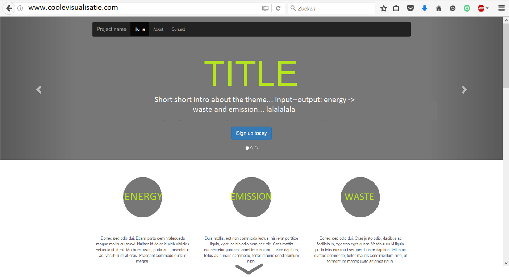
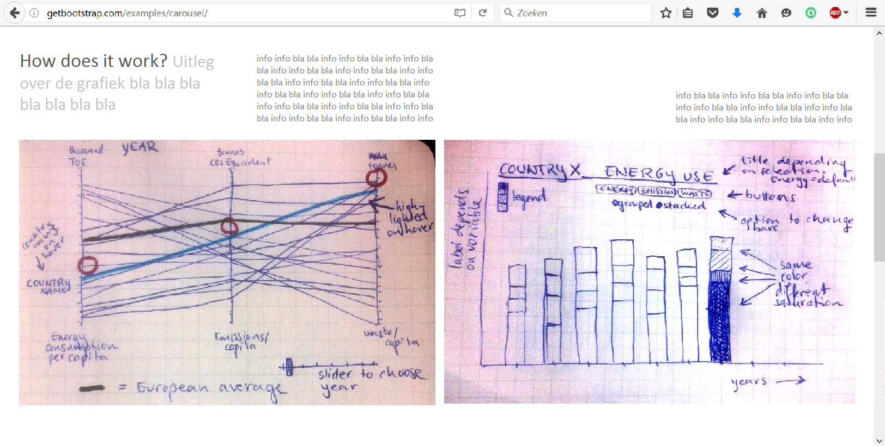
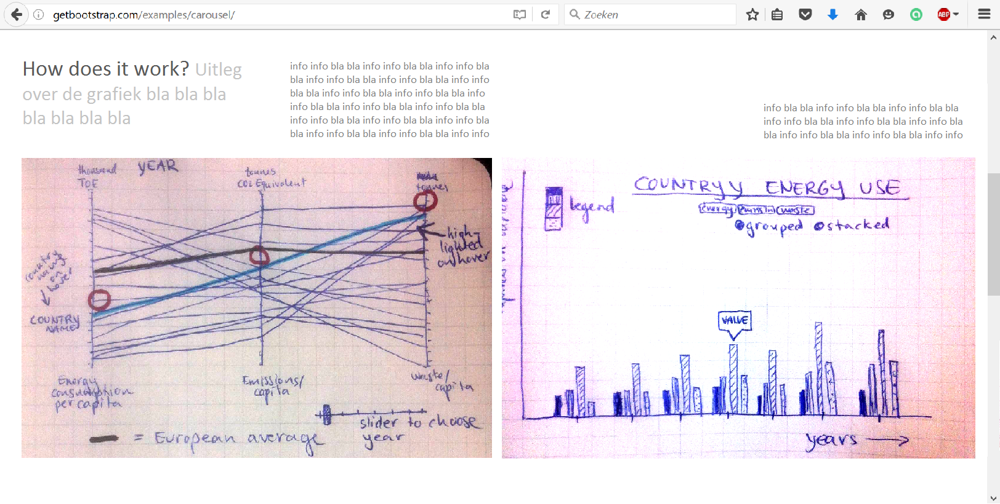

# DESIGN
Julia Jansen

### Sketches  

#### Page 1:  

This is the first thing the user will see. Underneath the title a short description will follow of the story: "what goes in, what comes out". From energy to problematic outcomes: (carbon) emissions and waste.  

Under the banner, the three topics are briefly defined: how are these concepts approached in this visualisation.  

C L I C K on the downwards pointing triangle at the bottom of the page and the whole layout changes to page 2.  

#### Page 2:   
   

On this page two graphs are shown. 
GRAPH 1 = A parallel coordinates graph shows a line for each county of Europe and connects their values on three axes:
* use of Energy / capita. Value in thousand tonnes of oil equivalent.
* greenhouse gas emissions / capita. Value in tonnes CO2 equivalent. 
* waste generation / capita. Value in tonnes.  
The European Average is displayed as a thick black line. Some explanation aobut the graph is offered next to the graph. Also the invitation to click on a line to see more specific information. 

###### Interactivity  
__On hover__ over a line that line becomes thicker and changes color. Also, a tooltip shows up close to every ax that contains the exact data for that subject and that country.  When a line is clicked, graph 2 is changed according to country specific data.
__The slider__ offers the opportunity to change the year that is displayed. 

GRAPH 2 = A bar graph
The default data for this graph is the European average. The user can choose by using buttons to either show energy use data, emission data or waste generation data. Also, the user can choose if the bars show the data stacked (all specific categories on top of each other) or grouped (one bar for each sub-topic). For example, energy are divided in different energy sources and waste generation can be specified by type of waste. The emissions are be specified by economic activity. 

###### Interactivity  
__on hover__ a tooltip is shown for the bar which one hovers over.
__buttons__ the user can choose a topic by clicking buttons. The graph title will change according to the topic. 

Sketch for grouped bars:  

Example of grouped/stacked bars:  
http://bl.ocks.org/mbostock/3943967  

##### Page 3: 

#### Plugins
* d3.js
* bootstrap

#### Data
* Energy:  
eurostat   
_complete energy, gas, oil, heat, solid fuels, waste-consumption, renewable energy, nuclear energy, primary production of energy, energy savings since 2005:  

* Emissions:  
eurostat  
_per country. all greenhouse gas emissions:  
http://ec.europa.eu/eurostat/statistics-explained/index.php/Greenhouse_gas_emission_statistics  
_per industry and per household:  
http://ec.europa.eu/eurostat/statistics-explained/index.php/Greenhouse_gas_emissions_by_industries_and_households

* Waste:  
eurostat
_waste per economic activity, waste generation (per waste)  
http://ec.europa.eu/eurostat/data/database?p_auth=9a8V6R3i&p_p_id=estatsearchportlet_WAR_estatsearchportlet&p_p_lifecycle=1&p_p_state=maximized&p_p_mode=view&_estatsearchportlet_WAR_estatsearchportlet_action=search&text=Generation+of+waste+by+economic+activity

The data will be formatted from csv to json and then loaded using the d3.json load function. One file (the waste per economic activity) will be loaded from directly using the load tsv function from the d3 library.  

#### File structure
* project.html
* folder: scripts  
> voor elk datafile een python script die de data (ofwel csv ofwel tsv) naar json omzet  
* folder sources:  
> * project.js __hierin wordt de data uit json geladen en de functie aangeroepen die de eerste grafiek tekent.
> * helper_functions.js __hierin worden helper functions gedefinieerd om bijvoorbeeld waardes om te rekenen of kleuren aan datapunten te linken. 
> * graphic_functions.js __hierin worden de functies beschreven die alle grafieken/tabellen vormen en op de pagina plaatsen.
> * project.css __style sheet van de webpagina.