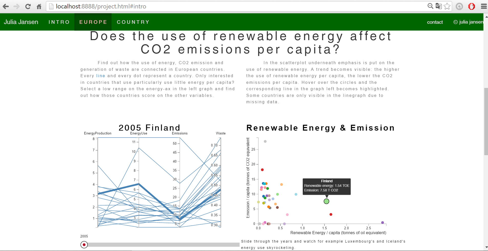

# Julia Jansen
# Report

## Beschrijving project
De visualisatie geeft een gebruiker inzicht in de samenhang tussen energieverbruik, energieproductie, uitstoot van CO2 en productie van afval. Aan de ene kant van het verhaal dus de input van een samenleving: energie. Energie is nodig voor alle facetten van ons leven. Maar hoe dragen de landen in Europa zorg voor de negatieve bij-effecten van alles waar die energie voor nodig is? Uitstoot van CO2 en productie van afval zijn wat er overblijft en vormen een groot probleem voor het mileu en daarmee ook het welzijn van alle mensen. 

In drie verschillende onderdelen wordt de samenhang tussen bovengenoemde variabelen weergegeven. De parallel coordinates grafiek geeft inzicht in de score van landen ten opzichte van elkaar voor de verschillende variabelen. Zijn de landen die veel energie per hoofd van de bevolking gebruiken ook landen die veel CO2 uitstoten per hoofd van de bevolking? Zijn de landen die veel primaire energie opwekken ook landen die veel CO2 uitstoten? 

De scatterplot geeft specifiek inzicht in de samenhang tussen het gebruik van duurzame energie en CO2 uitstoot per hoofd van de bevolking. De barchart geeft energie gebruik weer hoe deze is opgebouwd uit  verschillende energiebronnen. Over CO2 uitstoot en schadelijke afvalproductie geeft de barchart weer welke economische sectoren voor welk aandeel zorgen. 

SCREENSHOT pagina 1

## Technisch ontwerp
#### Mappen & Bestands structuur
Map 'project'
- map 'style': bevat alle stylesheets. Voor de pagina in zijn geheel is er project.css. Voor de aparte visuele onderdelen zijn er verder allemaal aparte stylesheets. 
- map 'scripts': 
** bevat een map 'python' met daarin alle python scripts die gebruikt zijn om de data om te zetten naar bruikbare csv bestanden.  
** bevat een map 'external' met javascript bestanden die ik heb gebruikt, maar niet zelf geschreven zoals de slider, een tooltip en d3.queue.  
** bevat voor elk visueel element een javascipt bestand.   
- map 'libs': hier staan bibliotheken die ik gebruikt heb zoals D3 en jQuery.
- map 'doc': hier zijn de afbeeldingen te vinden die in de markdown bestanden zijn gebruikt.
- map 'data': alle data die gebruikt wordt voor de visualisaties zijn hierin te vinden. De originele databestanden zijn allemaal te vinden in het mapje "archive".

#### Functies en *Handlers*
Elk visueel onderdeel wordt gedefinieerd in een functie. De globale variabelen zoals x-assen en margins die nodig zijn voor een visualisatie zijn soms boven de functie, maar in hetzelfde bestand gedefinieerd. Als allereerst wordt de data ingeladen met een queue, vervolgens wordt de functie prepareData() aangeroepen waarin de data naar Javascript objecten wordt omgezet. Vanuit 'prepareData()' worden de functies voor alle visuele elementen aangeroepen: barchart(), parallelGraph(), slider() en scatterplot(). De scatterplot en parallel coordinates grafiek worden ook aangeroepen wanneer de slider wordt bewogen. De barchart wordt aangeroepen wanneer er op de knopjes bij de barchart wordt geklikt en wanneer er op een lijn uit de parallelcoordinates of dot uit de scatterplot wordt geklikt. De scatterplot en de parallel coordinates graph geven data voor alle landen weer, met de slider kan een jaar geselecteerd worden. De barchart geeft juist voor één land data weer, maar dan over het verloop van de tijd. 

## Visueel eindproduct
##### Interactie

##### Parallel coordinates

##### Scatterplot

##### Barchart

##### Navigatie op pagina

#####

## Uitdagingen
##### Steden vs. landen
Het allereerste idee voor de visualisatie was het vergelijken van energiegebruik en CO2 uitstoot van grote steden met de landelijke waardes. Ik was benieuwd of steden juist vooruitstrevender zijn op gebied van duurzaam energiegebruik en uitstoot dat de landen als geheel of niet. Helaas bleek al snel dat er geen openbare data op één of enkele plekken over energiegebruik van alle grote steden in Europa te vinden was. Het uitzoeken van deze data per stad behoorde in de tijdspanne van vier weken voor het hele project helaas niet tot de mogelijkheden. Ook zou ik dan tegen problemen aanlopen van betrouwbaarheid omdat de data waarschijnlijk per land en per onderzoeksorganisatie anders worden gemeten. Op basis van die data steden met elkaar vergelijken zou dan moeilijk zijn. Kortom, ik heb de overstap gemaakt naar het vergelijken van landen in Europa. Deze data heb ik met name via eurostat en een van OECD stats verkregen. Ik hoop dat er in de toekomst meer open source data over stedelijk energieverbruik en uitstoot van broeikasgassen beschikbaar zal zijn. 

##### Plaatsing visualisaties en 'focus' van derde visualisatie
Gaandeweg is ook het ontwerp van de visualisatie een beetje veranderd ten opzichte van het eerste idee. Het idee voor de 'focus' pagina over een opvallend land is veranderd. Ik vond het interessanter om de samenhang tussen duurzame energie en uitstoot van CO2 te laten zien. Ik kwam op dat idee door de opvallende data van IJsland. Die springen er qua energiegebruik per capita uit, maar gebruiken wel met name duurzame zelf opgewekt energie (uit warmtebronnen). Aan de andere kant is te zien dat hun uitstoot per capita toch ook heel hoog is. Om meer te weten te komen over de samenhang tussen het gebruik van duurzame energie en CO2 uitstoot heb ik besloten deze scatterplot te maken als derde visualisatie. Omdat zowel deze scatterplot als de parallel coordinates over de tijd veranderen wanneer de slider wordt bewogen heb ik deze twee grafieken naast elkaar geplaatst. Wanneer in één van deze grafieken een land-element (lijn of cirkel) wordt aangeklikt, wordt de data voor dat land specifiek over de jaren weergegeven in een staafdiagram. De gebruiker kan dan kiezen welke variabele (energie gebruik, uitstoot of afval) wordt weergegeven. De staafdiagram geeft dus aanvullende informatie over de samenstelling en herkomst van de cijfers voor een land, wanneer de aandacht voor een land is getrokken op basis van de resultaten in de scatterplot of parallel coordinates grafiek. Een nadeel van deze drie visualisaties is dat ze niet alledrie op dezelfde pagina te zien zijn. Echter, wanneer de gebruiker eenmaal in één specifiek land geïnteresseerd is, geeft de staafdiagram verdiepende informatie. Het scrollen tussen de pagina's maakt het wel mogelijk gemakkelijk weer de visualisaties erboven in beeld te brengen. 

##### Grouped Barchart
Ik had het idee bij de barchart de gebruiker de keuze te geven tussen een *stacked* of *grouped* barchart. Ik ben erg lang bezig geweest om de verschillende x- en y-schalen die dan nodig zijn voor het berekenen van de juiste plek van de *bars* op de svg, maar helaas is het me niet gelukt om de juiste coördinaten voor stacked bars te berekenen en heb ik ervoor gekozen alleen een grouped weergave te geven van de variabelen. Daardoor ontstond wel de mogelijkheid om voor de variabele CO2 uitstoot alleen de 7 meest producerende economische sectoren weer te geven in plaats van alle 15+ sectoren die samen het totaal opmaakten, omdat de optelsom niet meer tot het totaal voor een jaar hoefde op te tellen, wat bij een stacked barchart wel het geval is. Dit heeft de barchart voor die variabele en stuk leesbaarder gemaakt. 

##### Geen tooltip voor meerdere y-assen tegelijk
De tooltip bij de parallel coordinates grafiek is anders dan gepland. Om de lijn door verschillende y-assen te tekenen is de schaal een array aan schalen voor elke y-as. Het is me nog niet gelukt om meerdere tooltips tegelijk weer tegeven op alle y-assen, omdat de y-as schaal die ik voor deze grafiek gebruik alleen een reeks inhoudt: de y-waardes voor alle assen. Deze waardes zijn ook niet simpelweg de x, en y-coordinaten maar waardes met letter er in. Het zou meer tijd (wat ik niet heb) vergen om precies uit te zoeken hoe ik deze waardes kan gebruiken voor de verschillende tooltips. 

## Tot slot
Al met al heb ik tijdens de afgelopen vier weken geleerd dat het prachtig zou zijn als er zoveel mogelijk data over steden voor iedereen beschikbaar zou zijn. Niet privacy gevoelige data natuurlijk, maar wel data die het mogelijk maken om verschillende gebieden en steden gemakkelijk met elkaar te vergelijken. 

Ook heb ik zelf ondervonden hoe sterk data visualisaties zijn voor het ontdekken van outliers. Dat IJsland en Luxemburg er zo uitschieten qua energie gebruik per hoofd van de bevolking is goed te zien, en ook dat de achterliggende redenen voor beide landen verschillend zijn wordt zichtbaar uit de staafdiagram. Dit vak heeft er zeker aan bijgedragen dat ik in de toekomst sneller zal proberen data visueel inzichtelijk te maken, simpelweg omdat opvallende resultaten dan letterlijk een ander uiterlijk hebben dan de rest van de data. 
