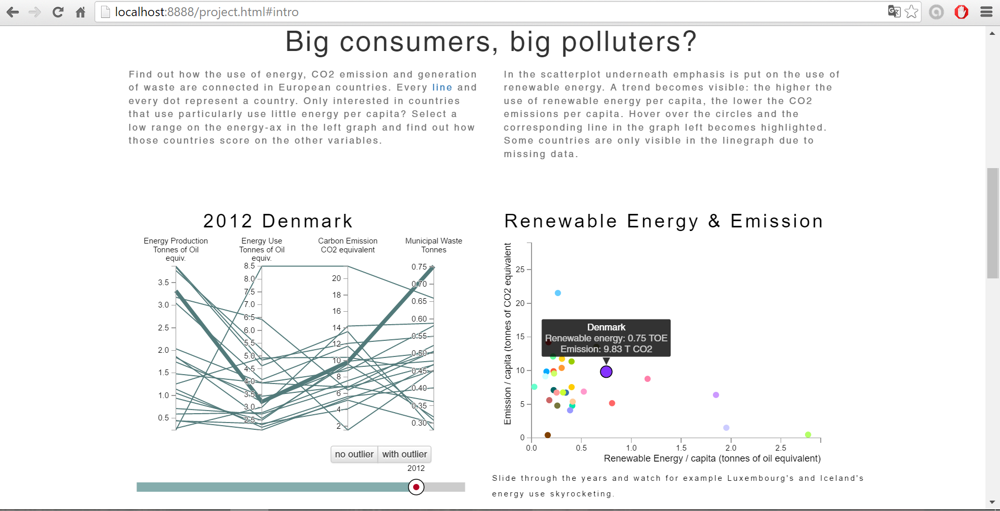

# Julia Jansen
# Report

## Beschrijving project
De visualisatie geeft een gebruiker inzicht in de samenhang tussen energieverbruik, energieproductie, uitstoot van CO2 en productie van afval. Aan de ene kant van het verhaal dus de input van een samenleving: energie. Energie is nodig voor alle facetten van ons leven. Maar hoe dragen de landen in Europa zorg voor de negatieve bij-effecten van alles waar die energie voor nodig is? Uitstoot van CO2 en productie van afval zijn de negatieve overblijfselen en vormen een groot probleem voor het mileu en daarmee ook het welzijn van alle mensen. 

In drie verschillende onderdelen wordt de samenhang tussen bovengenoemde variabelen weergegeven. De parallel coordinates grafiek geeft inzicht in de score van landen ten opzichte van elkaar voor de verschillende variabelen. Vragen die een gebruiker hiermee kan onderzoeken zijn: zijn de landen die veel energie per hoofd van de bevolking gebruiken ook landen die veel CO2 uitstoten per hoofd van de bevolking? Zijn de landen die veel primaire energie opwekken ook landen die veel CO2 uitstoten? 

De scatterplot geeft specifiek inzicht in de samenhang tussen het gebruik van duurzame energie en CO2 uitstoot per hoofd van de bevolking. De barchart geeft voor energie gebruik weer hoe deze is opgebouwd uit verschillende energiebronnen. Over CO2 uitstoot en schadelijke afvalproductie geeft de barchart weer welke economische sectoren voor welk aandeel zorgen. 

SCREENSHOT pagina 1

## Technisch ontwerp
#### Mappen & Bestands structuur
Map 'project'
- map 'style': bevat alle stylesheets. Voor de pagina in zijn geheel is er project.css. Voor de aparte visuele onderdelen zijn er verder allemaal aparte stylesheets. 
- map 'scripts': 
** bevat een map 'python' met daarin alle python scripts die gebruikt zijn om de data om te zetten naar bruikbare csv bestanden.  
** bevat een map 'external' met javascript bestanden die ik heb gebruikt, maar niet zelf geschreven zoals de slider, een tooltip en d3.queue.  
** bevat voor elk visueel element een javascipt bestand.
** bevat de bestanden listeners.js en slider.js die de reactie op interactieve elementen regelen.
** bevat helpers.js die globale functies bevat die nodig zijn in alle bestanden. 
- map 'libs': hier staan bibliotheken die ik gebruikt heb zoals D3 en jQuery.
- map 'doc': hier zijn alle afbeeldingen te vinden die gebruikt zijn in dit project.
- map 'data': alle data die gebruikt wordt voor de visualisaties zijn hierin te vinden. De originele databestanden zijn allemaal te vinden in het mapje "archive".

#### Functies en *Handlers*
Elk visueel onderdeel wordt gedefinieerd in een functie. De variabelen die onafhankelijk van de data gedefinieerd kunnen worden zijn gedeeltelijk boven de functie, maar in hetzelfde bestand gedefinieerd. Als allereerst wordt de data ingeladen met een queue, vervolgens wordt de functie prepareData() aangeroepen waarin de data naar Javascript objecten wordt omgezet. Vanuit 'prepareData()' worden de functies voor alle visuele elementen aangeroepen: barchart(), parallelGraph(), slider() en scatterplot(). De scatterplot en parallel coordinates grafiek worden ook aangeroepen wanneer de slider wordt bewogen. De barchart wordt aangeroepen wanneer er op de knopjes bij de barchart wordt geklikt en wanneer er op een lijn uit de parallelcoordinates of dot uit de scatterplot wordt geklikt. De scatterplot en de parallel coordinates graph geven data voor alle landen weer, met de slider kan een jaar geselecteerd worden. De barchart geeft juist voor één land data weer, maar dan over het verloop van de tijd. Alle visualisaties maken gebruik van de globaal gedefinieerde data en van variabelen die onthouden welk gedeelte van de data de gebruiker wil zien (outlier of niet, welk jaar, welke dataset). De interactieve elementen veranderen de waarde van deze variabelen en worden gedefinieerd in het bestand listeners.js en slider.js.

## Visueel eindproduct
##### Navigatie/Interactie op pagina
Het eerste beeld data een lezer ziet is een korte introductie over het thema van de visualisatie en een uitnodigende boodschap om verder naar beneden te scrollen. De tabbladen zijn te bereiken door te klikken in het menu of door naar beneden te scrollen voor een snelle navigatie. Op het tweede tabblad staan twee visualisaties die data over (bijna) alle landen in Europa weergeven en verder reageren op een slider. De twee grafieken laten data per jaar zien en met de slider is het jaar te veranderen. Tijdens het sliden kan de gebruiker dus veranderingen over de tijd zien. Wanneer één land wordt aangeklikt (een lijn of stip in één van de grafieken) scrollt de pagina automatisch naar beneden waar een barchart met data over het geselecteerde land verschijnt.

##### Parallel coordinates
De parallel coordinates grafiek laat per land een waarde voor vier verschillende variabelen zien door een lijn door vier y-assen te trekken. Elke as is geschaald op de data voor die variabele, wat betekent dat een land goed relatief te vergelijken is met de andere landen. Om de gebruiker de mogelijkheid te geven een specifieke interesse te onderzoeken kan op elke as een gebied tussen twee waardes geselecteerd worden en blijven alleen de lijnen van de landen die binnen het criterium vallen duidelijk zichtbaar. De rest van de lijnen vervaagd. Het is zo goed te onderzoeken of landen die hoog of laag op 1 variabele scoren (ten opzichte van andere landen) ook overeenkomende scores hebben op de andere variabelen. 

Wanneer de gebruiker over een lijn *hovert* krijgt die lijn extra nadruk, wordt in de titel van de grafiek zichtbaar om welk land het gaat, verschijnt een infovensterje met de exacte waardes voor de vier variabelen en krijgt de stip voor hetzelfde land in de scatterplot ook nadruk. Door deze link met de scatterplot ontstaat een extra mogelijkheid om meteen ook de samenhang tussen CO2 uitstoot en het gebruik van duurzame energie te onderzoeken. 

De interactie-elementen die het mogelijk maken om andere data in de grafieken te laten zien zijn onderaan de grafiek te vinden: de knopjes om de outlier (IJsland) uit de data te filteren en tevens een slider om een ander jaar te selecteren. Er is gekozen voor neutrale grijs- en blauwtinten voor deze elementen zodat ze niet te veel om aandacht vragen. 

Ideeën voor de toekomst: met nog meer tijd om aan het project te werken zou ik implementeren dat de selectie die iemand aangeeft op een y-as bewaard blijft bij het updaten van de dataset door te sliden of door te klikken of de outlier te zien moet zijn of niet. Het is dan gemakkelijker om te zien of landen sterk van waarde veranderen over de jaren heen. Vanwege dezelfde reden zou het interessant zijn een lijn dik te maken bij aanklikken en die dik te laten bij het sliden over de jaren heen. Op die manier zou één specifiek land over de jaren heen goed te bestuderen zijn.

##### Scatterplot
De scatterplot laat net als de parallel coordinates data voor alle landen in één jaar zien. Omdat het gebruik van duurzame energie onder andere gestimuleerd wordt om CO2 uitstoot te verminderen is het interessant om deze data tegen elkaar uit te zetten en direct naast de parallel coordinates graph weer te geven. Het geeft de lezer wat meer richting in het zoeken naar verbanden tussen de variabelen in de parallel coordinates graph. 

De assen van deze grafiek zijn vastgezet op de maximale waardes zodat het goed is te zien hoe de landen over de jaren heen veranderen. Wanneer de gebruiker over een punt *hovert* wordt het bolletje groter en zwartomlijnt voor extra nadruk. Bij zowel de scatterplot als de parallel coordinates grafiek wordt de lijn of het bolletje flink wat groter zodat het de gebruiker bij een kleine beweging niet direct de focus verliest: de bewegingsruimte binnen het gehighlighte element is groter. Tijdens het *hoveren* verschijnt ook een tooltip met de exacte waarde voor beide variabelen. Elk land heeft een eigen kleur, zodat het voor een lezer gemakkelijk is om één land te volgen wanneer met de slider over de jaren heen wordt bewogen. Omdat het om 36 landen gaat was het lastig om echt een mooi kleurenpallet bij elkaar te zoeken. De ingebouwde kleurenfuncties van d3 gaan niet verder dan 20 kleuren. 

Ideeën voor de toekomst: ik heb er nu voor nu gekozen om alle data in de parallel coordinates graph en scatterplot per hoofd van de bevolking weer te geven. Het zou interessant zijn om de gebruiker de keuze te geven om ook het absolute totaal per land te laten zien. Dan wordt namelijk zichtbaar dat IJsland met zijn enorme energieverbruik en uistoot per hoofd van de bevolking, in absolute getallen laag scoort vanewege de kleine populatie. 

##### Barchart
De barchart geeft voor één land weer hoe de waardes voor een bepaalde variabele (drie vd thema's uit de parallel coordinates grafiek) zijn veranderd over de jaren. Deze grafiek geeft bovendien inzicht in de opbouw van de waardes door per jaar te laten zien uit welke verschillende waardes het totaal voor dat jaar is opgemaakt. Afval en uitstoot worden weergegeven per economische sector, energiegebruik wordt weergegeven per energiebron. 

Voor elk van de verschillende barchartdata wordt een ander kleurenpallet gebruikt. Ik heb gekozen voor verschillende kleuren, omdat het gaat om verschillende variabelen, geen ordinale variabelen. De economische sectoren bij uitstoot en afval behouden dezelfde kleur als ze in beide grafieken voorkomen. De kleuren zijn bovendien intuïtief gekozen bij wat ze moeten representeren. Als kleur voor duurzame energie is bijvoorbeeld voor lichtgroen gekozen wat past bij "groene" energie. Bovendien is een fel groen gekozen om het op te laten vallen tussen de andere energiebronnen en dus de aandacht van de kijker hiernaartoe te trekken. Dat is in lijn met het verhaal van de webpagina. 

Idee voor de toekomst: met nog iets meer tijd zou ik bovenaan de barchart ook een zoekmenu'tje willen toevoegen waar de gebruiker kan zoeken naar een land uit de dataset. Bovendien zou ik dan ook per variabele een mooi pop-up venstertje willen maken dat verschijnt wanneer er op een vakje van de legenda wordt geklikt. Daar wordt dan de precies gemeten definitie van die variabele beschreven.

## Uitdagingen in het proces
##### Steden vs. landen
Het allereerste idee voor de visualisatie was het vergelijken van energiegebruik en CO2 uitstoot van grote steden met de landelijke waardes. Ik was benieuwd of steden juist vooruitstrevender zijn op gebied van duurzaam energiegebruik en uitstoot dat de landen als geheel of niet. Helaas bleek al snel dat er geen openbare data op één of enkele plekken over energiegebruik van alle grote steden in Europa te vinden was. Het uitzoeken van deze data per stad behoorde in de tijdspanne van vier weken voor het hele project helaas niet tot de mogelijkheden. Ook zou ik dan tegen problemen aanlopen van betrouwbaarheid omdat de data waarschijnlijk per land en per onderzoeksorganisatie anders worden gemeten. Op basis van die data steden met elkaar vergelijken zou dan moeilijk zijn. Kortom, ik heb de overstap gemaakt naar het vergelijken van landen in Europa. Deze data heb ik met name via eurostat en een van OECD stats verkregen. Ik hoop dat er in de toekomst meer open source data over stedelijk energieverbruik en uitstoot van broeikasgassen beschikbaar zal zijn. 

##### Plaatsing visualisaties en 'focus' van derde visualisatie
Gaandeweg is ook het ontwerp van de visualisatie een beetje veranderd ten opzichte van het eerste idee. Het idee voor de 'focus' pagina over een opvallend land is veranderd. Ik vond het interessanter om de samenhang tussen duurzame energie en uitstoot van CO2 te laten zien. Ik kwam op dat idee door de opvallende data van IJsland. Die springen er qua energiegebruik per capita uit, maar gebruiken wel met name duurzame zelf opgewekt energie (uit warmtebronnen). Aan de andere kant is te zien dat hun uitstoot per capita toch ook heel hoog is. Om meer te weten te komen over de samenhang tussen het gebruik van duurzame energie en CO2 uitstoot heb ik besloten deze scatterplot te maken als derde visualisatie. Omdat zowel deze scatterplot als de parallel coordinates over de tijd veranderen wanneer de slider wordt bewogen heb ik deze twee grafieken naast elkaar geplaatst. Wanneer in één van deze grafieken een land-element (lijn of cirkel) wordt aangeklikt, wordt de data voor dat land specifiek over de jaren weergegeven in een staafdiagram. De gebruiker kan dan kiezen welke variabele (energie gebruik, uitstoot of afval) wordt weergegeven. De staafdiagram geeft dus aanvullende informatie over de samenstelling en herkomst van de cijfers voor een land, wanneer de aandacht voor een land is getrokken op basis van de resultaten in de scatterplot of parallel coordinates grafiek. Een nadeel van deze drie visualisaties is dat ze niet alledrie op dezelfde pagina te zien zijn. Echter, wanneer de gebruiker eenmaal in één specifiek land geïnteresseerd is, geeft de staafdiagram verdiepende informatie. Het scrollen tussen de pagina's maakt het wel mogelijk gemakkelijk weer de visualisaties erboven in beeld te brengen. 

##### Grouped Barchart
Ik had het idee bij de barchart de gebruiker de keuze te geven tussen een *stacked* of *grouped* barchart. Ik ben erg lang bezig geweest om de verschillende x- en y-schalen die dan nodig zijn voor het berekenen van de juiste plek van de *bars* op de svg, maar helaas is het me niet gelukt om de juiste coördinaten voor stacked bars te berekenen en heb ik ervoor gekozen alleen een grouped weergave te geven van de variabelen. Daardoor ontstond wel de mogelijkheid om voor de variabele CO2 uitstoot alleen de 7 meest producerende economische sectoren weer te geven in plaats van alle 15+ sectoren die samen het totaal opmaakten, omdat de optelsom niet meer tot het totaal voor een jaar hoefde op te tellen, wat bij een stacked barchart wel het geval is. Dit heeft de barchart voor die variabele en stuk leesbaarder gemaakt. 

##### Geen tooltip voor meerdere y-assen tegelijk
De tooltip bij de parallel coordinates grafiek is anders dan gepland. Om de lijn door verschillende y-assen te tekenen is de schaal een array aan schalen voor elke y-as. Het is me nog niet gelukt om meerdere tooltips tegelijk weer tegeven op alle y-assen, omdat de y-as schaal die ik voor deze grafiek gebruik alleen een reeks inhoudt: de y-waardes voor alle assen. Deze waardes zijn ook niet simpelweg de x, en y-coordinaten maar waardes met letter er in. Het zou meer tijd (wat ik niet heb) vergen om precies uit te zoeken hoe ik deze waardes kan gebruiken voor de verschillende tooltips. 

##### De outliers
Al snel na het maken van de parallel coordinates werd duidelijk dat IJland een outlier was en daarom bij het sliden over de jaren heen de assen enorm beïnvloedde. Daardoor lijkt het visueel alsof alle andere landen veel dichter bij elkaar komen te liggen qua waardes. In de scatterplot liggen alle stipjes heel erg dicht op elkaar als IJland ook wordt weergegeven. IJsland uit de dataset halen zou ook zonde zijn, omdat het wel interessant is om te zien dat ze zo'n sterke outlier zijn. Uiteindelijk heb ik besloten om de gebruiker de optie te geven om de visualisaties met en zonder outlier te bekijken. Zo is ook goed te zien wat effect van de outlier op de data is.  

IJland is ook een onverwachtse outlier qua emissie. Na uitzoeken in mijn dataset en in andere datasets blijkt dat de uitschietende waarde hoogstwaarschijnlijk gevolg is van het feit dat in de door mij gebruikte dataset niet alleen direct CO2 emissie van transport, verbranding van brandstof en aangekochte elektriciteit stroom en gas berekend worden, maar ook alle indirecte CO2 uitstoot: 
"Purchased goods and services
Business travel
Employee commuting
Waste disposal
Use of sold products
Transportation and distribution (up- and downstream)
Investments"
Omdat de IJlandse bevolking heel klein is, maar het toerisme relatief groot (per hoofd van de bevolking) is dat goed terug te zien in de uitstoot/capita. 

## Tot slot
Al met al heb ik tijdens de afgelopen vier weken geleerd dat het prachtig zou zijn als er zoveel mogelijk data over steden voor iedereen beschikbaar zou zijn. Niet privacy gevoelige data natuurlijk, maar wel data die het mogelijk maken om verschillende gebieden en steden gemakkelijk met elkaar te vergelijken. 

Ook heb ik zelf ondervonden hoe sterk data visualisaties zijn voor het ontdekken van outliers. Dat IJsland en Luxemburg er zo uitschieten qua energie gebruik per hoofd van de bevolking is goed te zien, en ook dat de achterliggende redenen voor beide landen verschillend zijn wordt zichtbaar uit de staafdiagram. Dit vak heeft er zeker aan bijgedragen dat ik in de toekomst sneller zal proberen data visueel inzichtelijk te maken, simpelweg omdat opvallende resultaten dan letterlijk een ander uiterlijk hebben dan de rest van de data. 
